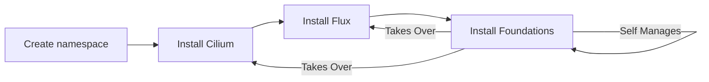

KRAUD CLOUD ENTERPRISE FOUNDATIONS
==================================

An opinionated foundational set of services for managed kubernetes.
We manage, tests, audits and support this stack for our customer clusters.
It is available to the public as a learning example only.
Pull requests will be ignored.
Please contact support at kraud dot cloud for support.

| chart                                  | version | license    | grade |
| -------------------------------------- | ------- | ---------- | ----- |
| cert-manager                           | 1.15    | Apache 2.0 | A     |
| cilium                                 | 1.15    | Apache 2.0 | A     |
| flux                                   | 2.3     | Apache 2.0 | A     |
| [klum](https://github.com/jadolg/klum) | 0.8.1   | Apache 2.0 | A     |
| haproxy                                | 1.4     | GPL-       | A     |
| longhorn                               | 1.6     | Apache 2.0 | B     |
| openebs                                | 4.1     | Apache 2.0 | B     |
| prometheus                             | 56.8    | Apache 2.0 | B     |

## Bootstrapping

In a clean cluster, edit `foundations/config.yaml` then run `./bootstrap/bootstrap.sh`

## Upgrading

Once you have a cluster in place, get your own copy of `./foundations` and use it to keep your cluster up to date. `./foundations/foundations.yaml` specifies the version of the helm chart to use.

A manual step is required when upgrading to a chart that has breaking changes. The upgrade process for each breaking change will be described below.
