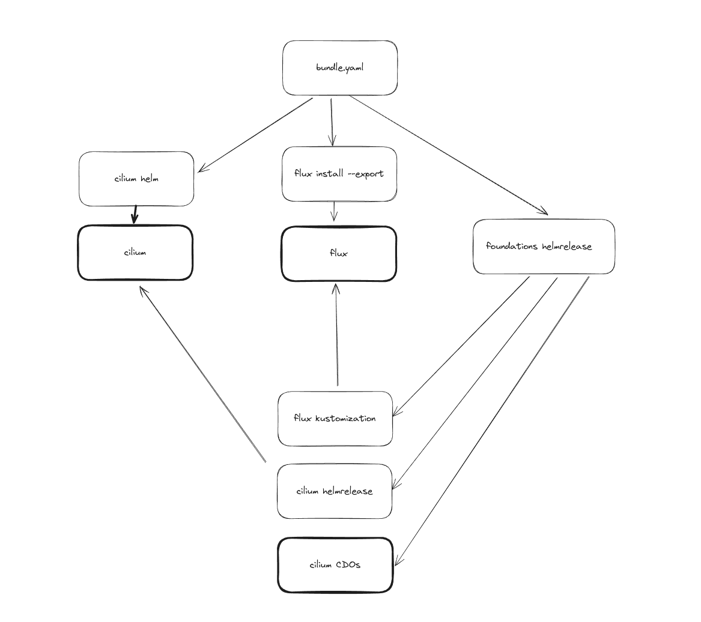

KRAUD CLOUD ENTERPRISE FOUNDATIONS
==================================

an opinionated foundational set of services for managed kubernetes that is

- well tested
- audited for high availability, security and compliance
- supported by kraud

## Bootstrapping


[](https://app.fossa.com/projects/git%2Bgithub.com%2Fkraudcloud%2Ffoundations?ref=badge_shield)

In a clean cluster, edit `bootstrap/user-skeleton.yaml` then run `./bootstrap/bootstrap.sh`

## Upgrading

### Flux

```sh
flux install --export --namespace foundations > flux/flux.yaml
```

Then the source stuff will pick it up and it will auto-upgrade

### Other components

Upgrade the respective helm version in `./charts/foundations/templates`


## License
[](https://app.fossa.com/projects/git%2Bgithub.com%2Fkraudcloud%2Ffoundations?ref=badge_large)